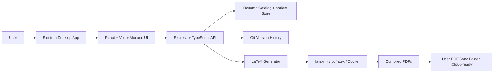
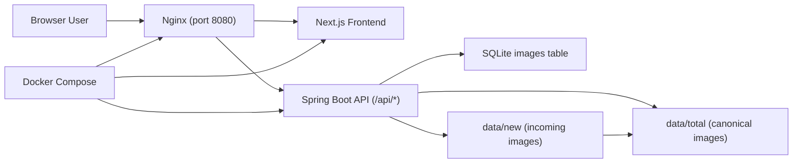

<!-- README.md — place in repo named Arnav-Purushotam -->

<!-- Profile Picture -->

  

<h1 align="center">Hey, I'm Arnav Purushotam&nbsp;👋</h1>

  <!-- LinkedIn -->
  
  <!-- Email -->
  

---

## 🧮 LeetCode Progress

  <!-- Count badges -->
  
  
  
   
  <!-- Percentile badges -->
  
  

  <!-- Live-updating card (no contest, no heatmap) -->
  

## 💼 Experience

### Open Source Contributor — curl / libcurl (C / Portability / Toolchains)

- Proposed and validated a cross-compiler logging strategy that enabled `CURL_DISABLE_VERBOSE_STRINGS` to truly compile out verbose trace format strings on **MSVC/Windows** via C99-style variadic trace macros; collaborated in public review with maintainers and was **credited in the final upstream solution**. ([PR #20387](https://github.com/curl/curl/pull/20387))
- Eliminated **GCC 15.2** `-Woverflow`/`-Wconversion` failures (often promoted to `-Werror` in CI) by preventing unintended high-bit propagation from `~mask` / `~0L` patterns, making auth/protocol/SSH option masks **warning-free, portable, and stable** when stored in 32-bit contexts.
- Contributed upstream fixes to **curl/libcurl** (large-scale, production, public-facing C codebase), hardening the `curl.h` public API bitmask macros against LP64 type-width pitfalls by constraining “ANY/ALL” masks to a **32-bit flag domain**, ensuring consistent behavior across 32/64-bit platforms. ([PR #20416](https://github.com/curl/curl/pull/20416))

## 💻 Projects

---

### 🗄️ Modular C++ Database Engine  
**August 2025 – September 2025**  
[github.com/Arnav-Purushotam-CUBoulder/cpp-db-engine](https://github.com/Arnav-Purushotam-CUBoulder/cpp-db-engine)

- Built a modular database engine in modern C++ (C++17/20): an in-memory hash map and a file-backed key–value store delivering `O(1)` lookups with durable writes; benchmarked against Redis to sanity-check throughput and latency.
- Designed a pluggable storage layer (PIMPL) to swap memory, disk, and cached-disk backends without changing call sites—setting the stage for sharding and future distribution.
- Added secondary indexes, bucketed namespaces, and templated key/value types (C++20 concepts) to enable fast searches over STL containers with zero-copy paths where possible.
- Automated cross-platform builds and tests with CMake and Catch2, using GitHub CLI; verified on Linux (GCC/Clang), macOS (Clang), and Windows (MSVC).
- Used complexity analysis to guide performance trade-offs.

---

### 🕒 CU Boulder Shift Scheduler  
**November 2024 – December 2024**  
[github.com/Arnav-Purushotam-CUBoulder/CUBoulder-Shift-Scheduler](https://github.com/Arnav-Purushotam-CUBoulder/CUBoulder-Shift-Scheduler)

Engineered a cloud-native, end-to-end shift-scheduling platform for high-traffic CU Boulder operations—bookstores, dining halls, and markets—using AWS EC2, CloudFormation, RDS, S3, and DynamoDB, with Flask APIs and Airflow orchestration.  
Automated scheduling workflows via AWS Lambda, SQS, SES, and CloudWatch event rules, delivering real-time notifications and error-free shift allocations.

**Architecture:**  

---

### 🛒 Distributed Student E-Commerce Platform  
**July 2024 – July 2025**  
[github.com/Arnav-Purushotam-CUBoulder/distributed-student-ecommerce-platform](https://github.com/Arnav-Purushotam-CUBoulder/distributed-student-ecommerce-platform)

Built a microservices-based e-commerce platform tailored to students, with separate Product, Inventory, Order, and Notification services behind a Spring Cloud Gateway and Angular 18 + Tailwind frontend.  
Enabled event-driven ordering with Kafka and Schema Registry, resilience with Resilience4j and Micrometer, and secured the app using Keycloak SSO.  
Deployed full-stack observability using Prometheus, Grafana, Loki, Tempo, and Zipkin; containerized via Docker Compose and later migrated to Kubernetes (Kind), with CI using Testcontainers.

**Architecture:**  

---

### 📄 Resume Automator  
**February 2026**  
[github.com/Arnav-Purushotam-CUBoulder/resume-automator](https://github.com/Arnav-Purushotam-CUBoulder/resume-automator)

- Architected a cross-process desktop app where an Electron shell hosts a React + Vite + Monaco frontend and delegates compile/version workflows to an Express + TypeScript backend.
- Designed a normalized resume domain model (global components, ordered variant composition, and block/point-level overrides) so variant-specific edits can detach cleanly from future global updates.
- Implemented a Git-backed persistence layer that snapshots edits, preserves commit-level traceability, and supports history browsing with historical PDF re-render from prior revisions.
- Built a resilient LaTeX pipeline with ordered compiler failover (`latexmk` -> `pdflatex` -> Docker `blang/latex:ctanfull`) and actionable error reporting when local toolchains are unavailable.
- Added iCloud-ready PDF sync with initial backfill and compile-time delta replacement so only changed resume outputs are updated in the target export folder.

**Architecture:**  

---

### 🧬 BioF Research OS  
**February 2026**  
[github.com/Arnav-Purushotam-CUBoulder/llm-project-biof](https://github.com/Arnav-Purushotam-CUBoulder/llm-project-biof)

- Engineered a production-style FastAPI + Next.js research platform with SSE streaming chat (`/api/v1/chat/stream`) that returns incremental responses followed by citation/confidence payloads.
- Implemented hybrid retrieval across SQL chunk storage and vector search (PostgreSQL + `pgvector`, Qdrant sync), plus Neo4j graph evidence querying under a tool-routed orchestrator.
- Added explicit agent routing modes (`auto`, `retrieval`, `graph`, `analytics`, `blended`) to control retrieval strategy and improve answer quality on mixed evidence tasks.
- Built asynchronous ingestion and processing with Celery + Redis workers for file/web source pipelines, with session/query logging for reproducibility and auditability.
- Delivered executive brief generation and benchmark APIs scoring recall, pass rate, faithfulness, citation density, and latency, then surfaced a composite grade in the frontend scoreboard.
- Productionized the stack with typed services and CI quality gates (`ruff`, `mypy`, `pytest`, frontend lint/test/build) plus GitHub Pages deployment for public demo visibility.

**Architecture:**  

---

### 🖼️ Snaplet  
**September 2025 – October 2025**  
[github.com/Arnav-Purushotam-CUBoulder/Snaplet](https://github.com/Arnav-Purushotam-CUBoulder/Snaplet)

- Built a containerized three-tier stack (Next.js frontend, Spring Boot API, Nginx reverse proxy) where Nginx multiplexes `/` to UI and `/api/*` to backend on one public endpoint.
- Implemented idempotent startup indexing in the backend: ensure quoted SQLite schema for `images`, seed from `data/total` on first run, and ingest `data/new` into canonical storage.
- Added collision-safe file migration logic (suffix-based rename) and sequential index assignment so newly dropped assets are incorporated without corrupting existing rows.
- Implemented random-image serving by sampling over `MAX(\"index\")`, resolving `image_path`, and streaming binary payloads from `/api/random-image`, with health/rebuild endpoints for operations.
- Optimized UX latency with a frontend prefetch queue (10 image blobs) so clicks render near-instantly while background requests continuously replenish buffered content.

**Architecture:**  

---

## 🤝 Connect
Open to collaborations on developing web software (full stack) or dev-tooling. Ping me on LinkedIn or raise an issue!
