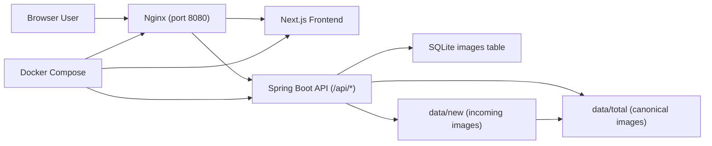

<!-- README.md — place in repo named Arnav-Purushotam -->

<!-- Profile Picture -->

  

<h1 align="center">Hey, I'm Arnav Purushotam&nbsp;👋</h1>

  <!-- LinkedIn -->
  
  <!-- Email -->
  

---

## 🧮 LeetCode Progress

  <!-- Count badges -->
  
  
  
   
  <!-- Percentile badges -->
  
  

  <!-- Live-updating card (no contest, no heatmap) -->
  

## 💼 Experience

### Open Source Contributor — curl / libcurl (C / Portability / Toolchains)

- Proposed and validated a cross-compiler logging strategy that enabled `CURL_DISABLE_VERBOSE_STRINGS` to truly compile out verbose trace format strings on **MSVC/Windows** via C99-style variadic trace macros; collaborated in public review with maintainers and was **credited in the final upstream solution**. ([PR #20387](https://github.com/curl/curl/pull/20387))
- Eliminated **GCC 15.2** `-Woverflow`/`-Wconversion` failures (often promoted to `-Werror` in CI) by preventing unintended high-bit propagation from `~mask` / `~0L` patterns, making auth/protocol/SSH option masks **warning-free, portable, and stable** when stored in 32-bit contexts.
- Contributed upstream fixes to **curl/libcurl** (large-scale, production, public-facing C codebase), hardening the `curl.h` public API bitmask macros against LP64 type-width pitfalls by constraining “ANY/ALL” masks to a **32-bit flag domain**, ensuring consistent behavior across 32/64-bit platforms. ([PR #20416](https://github.com/curl/curl/pull/20416))

## 💻 Projects

---

### 🗄️ Modular C++ Database Engine  
**August 2025 – September 2025**  
[github.com/Arnav-Purushotam-CUBoulder/cpp-db-engine](https://github.com/Arnav-Purushotam-CUBoulder/cpp-db-engine)

- Built a modular database engine in modern C++ (C++17/20): an in-memory hash map and a file-backed key–value store delivering `O(1)` lookups with durable writes; benchmarked against Redis to sanity-check throughput and latency.
- Designed a pluggable storage layer (PIMPL) to swap memory, disk, and cached-disk backends without changing call sites—setting the stage for sharding and future distribution.
- Added secondary indexes, bucketed namespaces, and templated key/value types (C++20 concepts) to enable fast searches over STL containers with zero-copy paths where possible.
- Automated cross-platform builds and tests with CMake and Catch2, using GitHub CLI; verified on Linux (GCC/Clang), macOS (Clang), and Windows (MSVC).
- Used complexity analysis to guide performance trade-offs.

---

### ⚡ vLLM + NVIDIA Nsight LLM Profiling  
**March 2026**  
[github.com/Arnav-Purushotam-CUBoulder/vLLM---Nvidia-Nsight-LLM-Profiling](https://github.com/Arnav-Purushotam-CUBoulder/vLLM---Nvidia-Nsight-LLM-Profiling)

- Built a GPU inference benchmarking and profiling workflow for **Phi-2** served with **vLLM 0.19.0** on an **AWS EC2 g6.xlarge** instance backed by an **NVIDIA L4 (24GB)** GPU.
- Benchmarked short and long prompts at concurrency `1`, `4`, and `8`, showing throughput scaling from **45.9 tok/s** to **342.5 tok/s** with only a modest latency increase from **2.18s** to **2.33s**.
- Captured and analyzed **NVIDIA Nsight Systems** traces to break down kernel-level behavior, finding GEMM-heavy execution (~45% of GPU time), efficient Flash Attention usage, and decode-stage `gemvx` kernels dominating token-by-token generation.
- Identified the system as decisively **GPU-bound** by measuring CPU-side wait behavior (`cudaEventSynchronize` / `cudaDeviceSynchronize`) and showing that output-token transfers back to CPU were effectively negligible.
- Automated reproducible setup, serving, benchmarking, profiling, and EC2 lifecycle management with Docker Compose and shell scripts so the full experiment can be rerun end to end on fresh infrastructure.

---

### 🕒 CU Boulder Shift Scheduler  
**November 2024 – December 2024**  
[github.com/Arnav-Purushotam-CUBoulder/CUBoulder-Shift-Scheduler](https://github.com/Arnav-Purushotam-CUBoulder/CUBoulder-Shift-Scheduler)

Engineered a cloud-native, end-to-end shift-scheduling platform for high-traffic CU Boulder operations—bookstores, dining halls, and markets—using AWS EC2, CloudFormation, RDS, S3, and DynamoDB, with Flask APIs and Airflow orchestration.  
Automated scheduling workflows via AWS Lambda, SQS, SES, and CloudWatch event rules, delivering real-time notifications and error-free shift allocations.

**Architecture:**  

---

### 🛒 Distributed Student E-Commerce Platform  
**July 2024 – July 2025**  
[github.com/Arnav-Purushotam-CUBoulder/distributed-student-ecommerce-platform](https://github.com/Arnav-Purushotam-CUBoulder/distributed-student-ecommerce-platform)

Built a microservices-based e-commerce platform tailored to students, with separate Product, Inventory, Order, and Notification services behind a Spring Cloud Gateway and Angular 18 + Tailwind frontend.  
Enabled event-driven ordering with Kafka and Schema Registry, resilience with Resilience4j and Micrometer, and secured the app using Keycloak SSO.  
Deployed full-stack observability using Prometheus, Grafana, Loki, Tempo, and Zipkin; containerized via Docker Compose and later migrated to Kubernetes (Kind), with CI using Testcontainers.

**Architecture:**  

---

### 🖼️ Snaplet  
**September 2025 – October 2025**  
[github.com/Arnav-Purushotam-CUBoulder/Snaplet](https://github.com/Arnav-Purushotam-CUBoulder/Snaplet)

- Built a containerized three-tier stack (Next.js frontend, Spring Boot API, Nginx reverse proxy) where Nginx multiplexes `/` to UI and `/api/*` to backend on one public endpoint.
- Implemented idempotent startup indexing in the backend: ensure quoted SQLite schema for `images`, seed from `data/total` on first run, and ingest `data/new` into canonical storage.
- Added collision-safe file migration logic (suffix-based rename) and sequential index assignment so newly dropped assets are incorporated without corrupting existing rows.
- Implemented random-image serving by sampling over `MAX(\"index\")`, resolving `image_path`, and streaming binary payloads from `/api/random-image`, with health/rebuild endpoints for operations.
- Optimized UX latency with a frontend prefetch queue (10 image blobs) so clicks render near-instantly while background requests continuously replenish buffered content.

**Architecture:**  

```mermaid
graph LR
  U["Browser User"] --> N["Nginx (port 8080)"]
  N --> FE["Next.js Frontend"]
  N --> API["Spring Boot API (/api/*)"]
  API --> DB["SQLite images table"]
  API --> TOT["data/total (canonical images)"]
  API --> NEW["data/new (incoming images)"]
  NEW --> TOT
  DC["Docker Compose"] --> N
  DC --> API
  DC --> FE
```

---

### 🐧 linuc — Lightweight Linux Container Runtime in C++  
**December 2025**  
[github.com/Arnav-Purushotam-CUBoulder/C-Lightweight-Linux-Container-Runtime](https://github.com/Arnav-Purushotam-CUBoulder/C-Lightweight-Linux-Container-Runtime)

- Built a lightweight Linux container runtime in C++ from scratch using `clone()`-based namespace isolation (PID, mount, UTS, IPC, network, and user namespaces) instead of Docker-level abstractions.
- Implemented container setup and hardening with UID/GID user-namespace mappings, `pivot_root`, `/proc` mounting, capability dropping via `libcap`, and `PR_SET_NO_NEW_PRIVS` to minimize post-launch privilege.
- Added cgroup v2 resource controls and supervision features including memory limits, CPU quotas, `pids.max`, stats collection, signal forwarding, and configurable restart policies for long-running processes.
- Built out developer-facing tooling with structured NDJSON logging, a 9-group integration test suite, startup/memory/CPU-isolation microbenchmarks, and a Lima-based macOS workflow for reproducible Linux testing.

---

## 🤝 Connect
Open to collaborations on developing web software (full stack) or dev-tooling. Ping me on LinkedIn or raise an issue!
